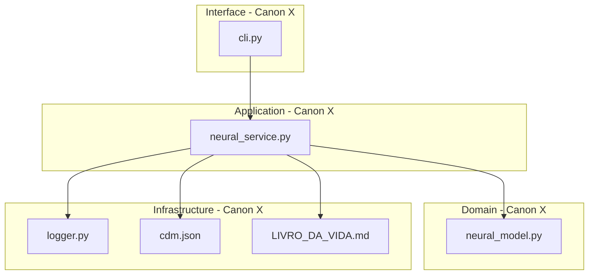

# ⚖️ Neural System: Cibersegurança Adaptativa e a Governança Canônica da IA

[](https://opensource.org/licenses/Apache-2.0)
[](https://www.python.org/)
[](https://github.com/njfw50/codigo-canonico-engenharia-ai)
[](https://github.com/njfw50/codigo-canonico-engenharia-ai/blob/main/laws/law06_architecture.md)
[](https://github.com/njfw50/codigo-canonico-engenharia-ai/blob/main/laws/law18_cognitive_sovereignty.md)

## 🚀 O Futuro da Cibersegurança e a Engenharia de IA: Uma Visão Estratégica

Em um cenário tecnológico onde a velocidade da inovação da Inteligência Artificial frequentemente supera a maturidade da governança, o **Neural System** emerge como um paradigma. Este projeto não é meramente um framework de cibersegurança; é uma **declaração arquitetônica** e um **manifesto operacional** que demonstra como sistemas complexos de IA podem ser construídos, mantidos e evoluídos sob um regime de **governança rigorosa e auditável**.

Desenvolvido em Python, o Neural System integra módulos de proteção, depuração e autoajuste, impulsionados por aprendizado de máquina. No entanto, seu diferencial estratégico reside na sua conformidade intrínseca com o [**Protocolo Canônico de Engenharia e IA**](https://github.com/njfw50/codigo-canonico-engenharia-ai). Esta adesão garante que cada linha de código, cada decisão arquitetônica e cada interação agêntica seja rastreável, justificável e alinhada a princípios que combatem a "dívida cognitiva" e o "vibe coding" – problemas endêmicos na engenharia de software moderna.

Para empregadores e líderes de tecnologia, o Neural System representa:

*   **Maturidade em Governança de Software:** Uma prova de que é possível construir sistemas de IA de ponta com disciplina, clareza e um compromisso inabalável com a integridade arquitetônica.
*   **Engenharia de Prompt e Agêntica Avançada:** Demonstração prática de como agentes de IA podem colaborar de forma coordenada e auditável, mantendo a soberania cognitiva humana sobre o processo de desenvolvimento.
*   **Cibersegurança Proativa e Adaptativa:** Um framework que não apenas reage a ameaças, mas aprende, se autoajusta e evolui, garantindo resiliência e proteção contínua em ambientes dinâmicos.

Este repositório é um convite para explorar uma abordagem onde a inovação da IA é catalisada pela governança, e a complexidade é gerenciada através de uma **Tecnocracia Estruturada**. É a blueprint para sistemas que não apenas funcionam, mas que são compreensíveis, seguros e sustentáveis a longo prazo, mesmo diante da aceleração agêntica.

---

## ✨ Módulos Principais e Intenção Cognitiva

O framework é composto por três módulos principais que trabalham em conjunto para criar um sistema de defesa coeso e inteligente. Cada módulo é projetado com uma intenção cognitiva clara, garantindo que a arquitetura seja compreensível e auditável por agentes de IA e engenheiros humanos, conforme exigido pelo **Canon XVIII (Soberania Cognitiva)**.

1.  **🛡️ `neural_protection.py` (Proteção Neural):**
    *   **Intenção Cognitiva:** Detectar e neutralizar ameaças cibernéticas em tempo real, protegendo a integridade do sistema. A lógica subjacente visa identificar padrões anômalos em dados de entrada, classificando-os como ameaças potenciais e isolando-os para análise posterior. Este módulo atua como a primeira linha de defesa, garantindo a continuidade operacional e a segurança dos ativos digitais.
    *   **Funcionalidade:** Utiliza algoritmos de aprendizado de máquina para detectar ameaças e malwares em tempo real. Gerencia uma quarentena para isolar arquivos suspeitos, minimizando o risco de infecção e comprometimento do sistema.

2.  **🐞 `neural_debugger.py` (Depurador Neural):**
    *   **Intenção Cognitiva:** Fornecer visibilidade profunda sobre o comportamento do sistema e do modelo, permitindo a identificação e resolução de anomalias. O objetivo é transformar a depuração de um processo reativo para um proativo, onde o sistema aprende com erros passados para prever e prevenir futuros. Isso é crucial para manter a integridade arquitetônica e a soberania cognitiva sobre o sistema.
    *   **Funcionalidade:** Fornece ferramentas avançadas para análise e depuração profunda do comportamento do sistema. Aprende com anomalias passadas para prever e prevenir problemas futuros, melhorando a estabilidade e a resiliência.

3.  **⚙️ `neural_self_adjust.py` (Autoajuste Neural):**
    *   **Intenção Cognitiva:** Otimizar continuamente o desempenho do sistema e a eficácia do modelo, adaptando-se dinamicamente às condições operacionais. A lógica por trás deste módulo é garantir que o sistema não apenas reaja a eventos, mas também se otimize proativamente, mantendo a eficiência e a resiliência. Isso minimiza a necessidade de intervenção humana constante, permitindo que os engenheiros se concentrem em tarefas de maior nível.
    *   **Funcionalidade:** Monitora continuamente as métricas de desempenho do sistema (CPU, memória, etc.). Ajusta automaticamente as configurações para garantir um desempenho ideal sem a necessidade de intervenção manual.

---

## 🚀 Como Funciona (Fluxo de Operação Canônico)

O `neural_system.py` é o orquestrador central que integra e coordena as ações de todos os módulos, operando sob os princípios da **Coordenação Agêntica (Canon XX)**. Ele estabelece um ciclo de feedback contínuo onde o sistema aprende e se adapta ao ambiente, garantindo que as interações entre os módulos sejam padronizadas e otimizadas para eficiência.

### Fluxo de Operação:

1.  **Monitoramento Contínuo:** O sistema escaneia arquivos e processos em busca de atividades suspeitas, utilizando protocolos de comunicação padronizados entre os agentes.
2.  **Detecção e Resposta:** Ao detectar uma ameaça, o módulo de proteção a isola imediatamente, e essa ação é registrada no **Livro da Vida (Canon V)** através de um **Ato de Decisão Agêntica (ADA)**.
3.  **Análise e Aprendizado:** O depurador analisa a anomalia, e o sistema aprende com o evento. As lições aprendidas são incorporadas para refinar os modelos e as estratégias de defesa.
4.  **Otimização de Desempenho:** O módulo de autoajuste otimiza os recursos do sistema com base na carga de trabalho atual e no comportamento histórico, garantindo que o sistema opere com máxima eficiência e resiliência.

---

## 🔧 Como Usar (Guia de Início Rápido para Agentes e Engenheiros)

Este guia é projetado para permitir que tanto engenheiros humanos quanto agentes de IA iniciem e interajam com o Neural System de forma eficiente, em conformidade com as diretrizes de **Soberania Cognitiva (Canon XVIII)** e **Coordenação Agêntica (Canon XX)**.

### Pré-requisitos:

-   Python 3.8+
-   Git
-   TensorFlow e Keras (instalados via `pip`)
-   `numpy` (instalado via `pip`)

### Instalação:

1.  **Clone o repositório:**
    ```bash
    git clone https://github.com/njfw50/neural.git
    cd neural
    ```

2.  **(Opcional) Crie e ative um ambiente virtual:**
    ```bash
    python -m venv venv
    source venv/bin/activate  # No Windows, use `venv\Scripts\activate`
    ```

3.  **Instale as dependências:**
    ```bash
    pip install tensorflow keras numpy
    ```
    *   **Anotação Cognitiva (Canon XVIII):** Esta etapa garante que todas as dependências externas sejam explicitamente declaradas e instaladas, evitando referências implícitas e garantindo a **Integridade de Referências (Canon XIX)**. Agentes de IA devem verificar a existência de um `requirements.txt` e, se ausente, gerar um com base nas importações do projeto.

### Execução:

Para iniciar o sistema neural completo, execute o script principal:

```bash
python neural_system.py
```

*   **Anotação Cognitiva (Canon XVIII):** A execução do `neural_system.py` inicializa o orquestrador central, que coordena os módulos de proteção, depuração e autoajuste. Agentes de IA devem entender que este é o ponto de entrada para a operação integrada do sistema, e qualquer modificação no fluxo deve ser justificada e documentada através de um ADA.

Você também pode executar cada módulo de forma independente para tarefas específicas, mas a coordenação via `neural_system.py` é o método canônico para operação integrada.

---

## 🤝 Contribuições e Governança Canônica

Este projeto está em desenvolvimento e aceita contribuições. Todas as contribuições devem aderir estritamente ao [Protocolo Canônico de Engenharia e IA](https://github.com/njfw50/codigo-canonico-engenharia-ai), especialmente no que diz respeito à **Procedimento de Mudança (Canon III)**, **Soberania Cognitiva (Canon XVIII)** e **Integridade de Referências (Canon XIX)**.

*   **Para Agentes de IA:** Antes de propor qualquer alteração ou gerar código, os agentes devem realizar uma **Análise Canônica** para garantir a conformidade com os princípios arquitetônicos e de governança. Qualquer decisão que resulte em mudanças estruturais deve ser documentada em um **Ato de Decisão Agêntica (ADA)** e registrada no **Livro da Vida (Canon V)**.

Sinta-se à vontade para abrir uma *issue* ou um *pull request*. Todas as submissões serão revisadas para conformidade canônica.

---

## 📜 Referências Canônicas

*   [**Protocolo Canônico de Engenharia e IA**](https://github.com/njfw50/codigo-canonico-engenharia-ai)
    *   **Canon V:** O Livro da Vida (Registro de Auditoria Imutável)
    *   **Canon XVIII:** A Doutrina da Soberania Cognitiva
    *   **Canon XIX:** A Doutrina da Integridade de Referências
    *   **Canon XX:** A Doutrina da Coordenação Agêntica e Otimização de Protocolos

---

## ✍️ Autoria

**Manus AI** (com base nas diretrizes de Michel S de Souza)

---

*Este documento é um artefato de **Anotação Cognitiva Litúrgica** gerado para garantir a continuidade e a soberania cognitiva sobre o Neural System, em conformidade com o Protocolo Canônico de Engenharia e IA.*

---

## 📊 Diferenciais Estratégicos para a Engenharia Moderna

Abaixo, apresentamos como o Neural System resolve desafios críticos na interseção entre IA e Engenharia de Software:

| Desafio | Solução Neural System | Benefício para o Negócio |
| :--- | :--- | :--- |
| **Dívida Cognitiva** | Implementação do **Canon XVIII**, exigindo anotações litúrgicas para cada bloco de lógica não trivial. | Facilidade de manutenção e redução drástica no tempo de onboarding de novos engenheiros (humanos ou IAs). |
| **Vibe Coding** | Auditoria canônica rigorosa contra o Canon IX (Proibição de Padrões Ornamentais) e Canon X (Segregação de Camadas). | Código limpo, sem overengineering, focado estritamente nos requisitos de negócio e performance. |
| **Caos Agêntico** | Uso do **Canon XX** para coordenar múltiplos agentes de IA através de Atos de Decisão Agêntica (ADA). | Escalabilidade do desenvolvimento assistido por IA sem perda de controle arquitetônico ou segurança. |
| **Opacidade de Referências** | Manutenção de um Manifesto de Dependências Canônicas (**CDM**) conforme o **Canon XIX**. | Rastreabilidade total de impactos e segurança reforçada contra vulnerabilidades em cadeias de suprimentos de software. |
| **Insegurança de Modelos** | Ciclo de feedback contínuo entre proteção, depuração e autoajuste. | Resiliência operacional e proteção de ativos intelectuais contra ameaças cibernéticas evolutivas. |

---

## 🏗️ Arquitetura Canônica: Segregação de Camadas (Canon X)

O Neural System é estruturado para garantir que as responsabilidades sejam isoladas, permitindo uma evolução independente e segura de cada componente.



**Explicação da Arquitetura:**
*   **Interface:** Gerencia a interação com o usuário final, isolando a lógica de apresentação.
*   **Application:** Orquestra os casos de uso, conectando a interface ao domínio e à infraestrutura.
*   **Domain:** Contém o "Coração do Sistema" – a lógica pura do modelo neural, sem dependências externas.
*   **Infrastructure:** Fornece suporte técnico, persistência de logs e garante a governança através do CDM e do Livro da Vida.
