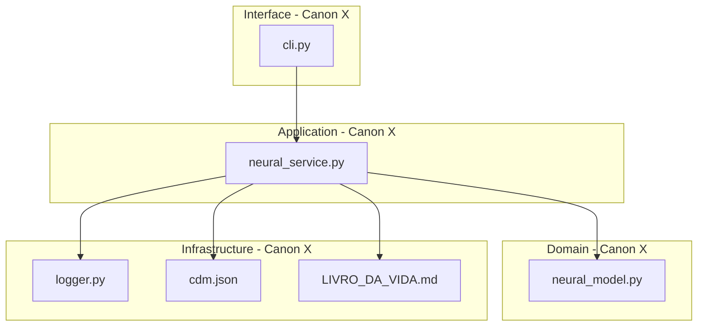

# ⚖️ Neural System: Adaptive Cybersecurity and the Canonical Governance of AI

[](https://opensource.org/licenses/Apache-2.0)
[](https://www.python.org/)
[](https://github.com/njfw50/codigo-canonico-engenharia-ai)
[](https://github.com/njfw50/codigo-canonico-engenharia-ai/blob/main/laws/law06_architecture.md)
[](https://github.com/njfw50/codigo-canonico-engenharia-ai/blob/main/laws/law18_cognitive_sovereignty.md)

## 🚀 The Future of Cybersecurity and AI Engineering: A Strategic Vision

In a technological landscape where the pace of Artificial Intelligence innovation often outstrips governance maturity, the **Neural System** emerges as a paradigm. This project is not merely a cybersecurity framework; it is an **architectural statement** and an **operational manifesto** that demonstrates how complex AI systems can be built, maintained, and evolved under a regime of **rigorous and auditable governance**.

Developed in Python, the Neural System integrates protection, debugging, and self-tuning modules driven by machine learning. However, its strategic differentiator lies in its intrinsic compliance with the [**Canonical Protocol for Engineering and AI**](https://github.com/njfw50/codigo-canonico-engenharia-ai). This adherence ensures that every line of code, every architectural decision, and every agentic interaction is traceable, justifiable, and aligned with principles that combat "cognitive debt" and "vibe coding" — endemic problems in modern software engineering.

For employers and technology leaders, the Neural System represents:

*   **Maturity in Software Governance:** Proof that it is possible to build cutting-edge AI systems with discipline, clarity, and an unwavering commitment to architectural integrity.
*   **Advanced Prompt Engineering and Agentic Coordination:** A practical demonstration of how AI agents can collaborate in a coordinated and auditable way while preserving human cognitive sovereignty over the development process.
*   **Proactive and Adaptive Cybersecurity:** A framework that not only reacts to threats but learns, self-adjusts, and evolves, ensuring resilience and continuous protection in dynamic environments.

This repository is an invitation to explore an approach where AI innovation is catalyzed by governance, and complexity is managed through a **Structured Technocracy**. It is the blueprint for systems that not only work, but that are understandable, secure, and sustainable over the long term, even in the face of accelerating agentic activity.

---

## ✨ Core Modules and Cognitive Intent

The framework is composed of three main modules that work together to create a cohesive, intelligent defense system. Each module is designed with a clear cognitive intent, ensuring that the architecture is understandable and auditable by AI agents and human engineers, as required by **Canon XVIII (Cognitive Sovereignty)**.

1.  **🛡️ `neural_protection.py` (Neural Protection):**
    *   **Cognitive Intent:** Detect and neutralize cyber threats in real time, protecting system integrity. The underlying logic aims to identify anomalous patterns in input data, classify them as potential threats, and isolate them for later analysis. This module acts as the first line of defense, ensuring operational continuity and the security of digital assets.
    *   **Functionality:** Uses machine learning algorithms to detect threats and malware in real time. Manages a quarantine to isolate suspicious files, minimizing the risk of infection and system compromise.

2.  **🐞 `neural_debugger.py` (Neural Debugger):**
    *   **Cognitive Intent:** Provide deep visibility into system and model behavior, enabling the identification and resolution of anomalies. The goal is to transform debugging from a reactive process into a proactive one, where the system learns from past errors to predict and prevent future ones. This is crucial to maintain architectural integrity and cognitive sovereignty over the system.
    *   **Functionality:** Provides advanced tools for deep analysis and debugging of system behavior. Learns from past anomalies to predict and prevent future problems, improving stability and resilience.

3.  **⚙️ `neural_self_adjust.py` (Neural Self-Adjust):**
    *   **Cognitive Intent:** Continuously optimize system performance and model efficacy, dynamically adapting to operational conditions. The logic behind this module is to ensure the system not only reacts to events but also proactively optimizes itself, maintaining efficiency and resilience. This minimizes the need for constant human intervention, allowing engineers to focus on higher-level tasks.
    *   **Functionality:** Continuously monitors system performance metrics (CPU, memory, etc.). Automatically adjusts configurations to ensure optimal performance without manual intervention.

---

## 🚀 How It Works (Canonical Operation Flow)

`neural_system.py` is the central orchestrator that integrates and coordinates the actions of all modules, operating under the principles of **Agentic Coordination (Canon XX)**. It establishes a continuous feedback loop where the system learns and adapts to the environment, ensuring that interactions between modules are standardized and optimized for efficiency.

### Operation Flow:

1.  **Continuous Monitoring:** The system scans files and processes for suspicious activity, using standardized communication protocols between agents.
2.  **Detection and Response:** Upon detecting a threat, the protection module immediately isolates it, and this action is recorded in the **Book of Life (Canon V)** through an **Agentic Decision Act (ADA)**.
3.  **Analysis and Learning:** The debugger analyzes the anomaly, and the system learns from the event. Lessons learned are incorporated to refine models and defense strategies.
4.  **Performance Optimization:** The self-adjust module optimizes system resources based on current workload and historical behavior, ensuring the system operates with maximum efficiency and resilience.

---

## 🔧 How to Use (Quick Start Guide for Agents and Engineers)

This guide is designed to enable both human engineers and AI agents to start and interact with the Neural System efficiently, in compliance with the guidelines of **Cognitive Sovereignty (Canon XVIII)** and **Agentic Coordination (Canon XX)**.

### Prerequisites:

-   Python 3.8+
-   Git
-   TensorFlow and Keras (installed via `pip`)
-   `numpy` (installed via `pip`)

### Installation:

1.  **Clone the repository:**
    ```bash
    git clone https://github.com/njfw50/neural.git
    cd neural
    ```

2.  **(Optional) Create and activate a virtual environment:**
    ```bash
    python -m venv venv
    source venv/bin/activate  # On Windows, use `venv\Scripts\activate`
    ```

3.  **Install dependencies:**
    ```bash
    pip install tensorflow keras numpy
    ```
    *   **Cognitive Annotation (Canon XVIII):** This step ensures that all external dependencies are explicitly declared and installed, avoiding implicit references and ensuring **Integrity of References (Canon XIX)**. AI agents should check for the existence of a `requirements.txt` and, if absent, generate one based on the project's imports.

### Execution:

To start the full neural system, run the main script:

```bash
python neural_system.py
```

*   **Cognitive Annotation (Canon XVIII):** Running `neural_system.py` initializes the central orchestrator, which coordinates the protection, debugging, and self-adjustment modules. AI agents should understand that this is the entry point for integrated system operation, and any modification to the flow must be justified and documented through an ADA.

You may also run each module independently for specific tasks, but coordination via `neural_system.py` is the canonical method for integrated operation.

---

## 🤝 Contributions and Canonical Governance

This project is under development and accepts contributions. All contributions must strictly adhere to the [Canonical Protocol for Engineering and AI](https://github.com/njfw50/codigo-canonico-engenharia-ai), especially regarding the **Change Procedure (Canon III)**, **Cognitive Sovereignty (Canon XVIII)**, and **Integrity of References (Canon XIX)**.

*   **For AI Agents:** Before proposing any change or generating code, agents must perform a **Canonical Analysis** to ensure compliance with architectural and governance principles. Any decision that results in structural changes must be documented in an **Agentic Decision Act (ADA)** and recorded in the **Book of Life (Canon V)**.

Feel free to open an *issue* or a *pull request*. All submissions will be reviewed for canonical compliance.

---

## 📜 Canonical References

*   [**Canonical Protocol for Engineering and AI**](https://github.com/njfw50/codigo-canonico-engenharia-ai)
    *   **Canon V:** The Book of Life (Immutable Audit Log)
    *   **Canon XVIII:** The Doctrine of Cognitive Sovereignty
    *   **Canon XIX:** The Doctrine of Integrity of References
    *   **Canon XX:** The Doctrine of Agentic Coordination and Protocol Optimization

---

## ✍️ Authorship

**Manus AI** (based on the guidelines of Michel S de Souza)

---

*This document is an artifact of **Liturgical Cognitive Annotation** generated to ensure continuity and cognitive sovereignty over the Neural System, in compliance with the Canonical Protocol for Engineering and AI.*

---

## 📊 Strategic Differentiators for Modern Engineering

Below we present how the Neural System addresses critical challenges at the intersection of AI and Software Engineering:

| Challenge | Neural System Solution | Business Benefit |
| :--- | :--- | :--- |
| **Cognitive Debt** | Implementation of **Canon XVIII**, requiring liturgical annotations for every non-trivial block of logic. | Easier maintenance and a drastic reduction in onboarding time for new engineers (human or AI). |
| **Vibe Coding** | Rigorous canonical auditing against Canon IX (Prohibition of Ornamental Patterns) and Canon X (Layer Segregation). | Clean code, no overengineering, strictly focused on business requirements and performance. |
| **Agentic Chaos** | Use of **Canon XX** to coordinate multiple AI agents through Agentic Decision Acts (ADA). | Scalability of AI-assisted development without loss of architectural control or security. |
| **Reference Opacity** | Maintenance of a Canonical Dependency Manifest (**CDM**) per **Canon XIX**. | Full traceability of impacts and strengthened security against supply-chain vulnerabilities. |
| **Model Insecurity** | Continuous feedback loop between protection, debugging, and self-adjust. | Operational resilience and protection of intellectual assets against evolving cyber threats. |

---

## 🏗️ Canonical Architecture: Layer Segregation (Canon X)

The Neural System is structured to ensure responsibilities are isolated, allowing each component to evolve independently and safely.



**Architecture Explanation:**
*   **Interface:** Manages interaction with the end user, isolating presentation logic.
*   **Application:** Orchestrates use cases, connecting the interface to the domain and infrastructure.
*   **Domain:** Contains the "Heart of the System" — the pure neural model logic, without external dependencies.
*   **Infrastructure:** Provides technical support, log persistence, and enforces governance through the CDM and the Book of Life.